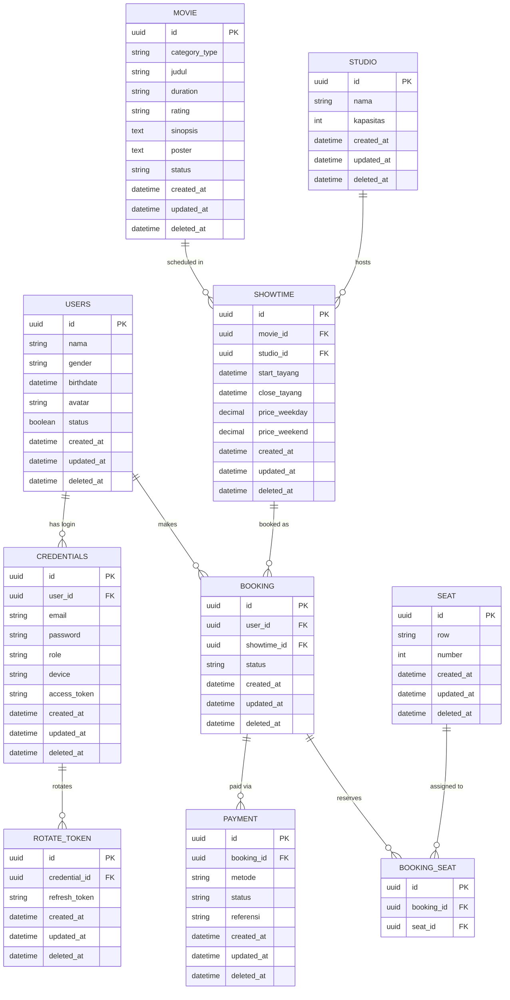

# Database Documentation: Cinema Ticketing System

This document outlines the Entity Relationship Diagram design, entity details, business logic flow, and technical standards implemented in the cinema ticketing database schema.

---

## Entity Relationship Diagram

---

## ️ Entity & Table Details

### Authentication & User Management
* **`USERS`**: Stores basic profile information for registered users/customers.
    * `id`: Primary key (UUID).
    * `nama`, `gender`, `birthdate`, `avatar`: User profile details.
    * `status`: Active status of the user account.
* **`CREDENTIALS`**: Stores sensitive authentication credentials and login session data.
    * `user_id`: Foreign key referencing the `USERS` table.
    * `email`, `password`: Login credentials.
    * `role`: Access permission role (e.g., `admin`, `customer`).
    * `device`, `access_token`: Active device session and JWT access token.
* **`ROTATE_TOKEN`**: Handles refresh token rotation for secure token-based authentication (JWT/OAuth).
    * `credential_id`: Foreign key referencing `CREDENTIALS`.
    * `refresh_token`: Token used to issue new access tokens.

### Catalog & Theater Management
* **`MOVIE`**: Master catalog containing movie information.
    * `category_type`, `judul`, `duration`, `rating`, `sinopsis`, `poster`: Movie metadata.
    * `status`: Movie screening status (e.g., `now_showing`, `coming_soon`, `archived`).
* **`STUDIO`**: Master data for cinema halls/auditoriums.
    * `nama`: Name or studio identifier.
    * `kapasitas`: Total seating capacity.
* **`SEAT`**: Master dataset for individual seat layouts within studios.
    * `row`: Seat row designation (e.g., 'A', 'B').
    * `number`: Seat number (e.g., 1, 2, 3).
* **`SHOWTIME`**: Scheduling table mapping movies to specific studios and times.
    * `movie_id`, `studio_id`: Foreign keys linking the movie and studio.
    * `start_tayang`, `close_tayang`: Showtime start and end timestamps.
    * `price_weekday`, `price_weekend`: Dynamic ticket pricing based on day type.

###  Booking & Payment Management
* **`BOOKING`**: Records ticket purchase transactions created by users.
    * `user_id`: Foreign key referencing the buyer.
    * `showtime_id`: Foreign key referencing the chosen movie schedule.
    * `status`: Booking order status (e.g., `pending`, `confirmed`, `cancelled`).
* **`BOOKING_SEAT`**: Junction/Pivot table mapping reserved seats to a specific booking transaction.
    * `booking_id`: Foreign key referencing `BOOKING`.
    * `seat_id`: Foreign key referencing `SEAT`.
* **`PAYMENT`**: Stores payment gateway transaction logs for a booking.
    * `booking_id`: Foreign key referencing the associated booking.
    * `metode`: Payment method (e.g., `qris`, `bank_transfer`, `credit_card`).
    * `status`: Payment status (`pending`, `success`, `failed`).
    * `referensi`: Unique payment gateway transaction reference ID.

---

## Business Logic Flow

1. **User Registration & Authentication**:
    - A user signs up -> Basic profile data is stored in `USERS`, while sensitive login credentials are saved in `CREDENTIALS`.
    - Upon successful login, an access token is updated in `CREDENTIALS` and a refresh token is logged in `ROTATE_TOKEN`.

2. **Showtime Creation**:
    - Admins configure movie schedules by pairing a `MOVIE` with a `STUDIO` in the `SHOWTIME` table, defining screening timestamps and pricing tiers.

3. **Ticket Booking**:
    - The customer selects a schedule from `SHOWTIME` and available seats from `SEAT`.
    - A new record is created in `BOOKING` with a default status of `pending`.
    - The selected seats are mapped in `BOOKING_SEAT` to reserve them and prevent double booking.

4. **Payment Processing**:
    - A payment record is created in `PAYMENT` linked to the `booking_id`.
    - Upon payment verification via payment gateway callback, the statuses in both `PAYMENT` and `BOOKING` are updated to `success`/`paid`.

---

##  Standards & Database Conventions

* **Primary Keys (PK)**: Uses `UUID` across all tables to prevent sequential ID enumeration attacks and support distributed system scalability.
* **Audit Timestamps**: All major entities include `created_at` and `updated_at` fields for tracking modifications and data auditing.
* **Soft Deletes**: Implemented via the `deleted_at` field to preserve transaction historical records and maintain relational integrity without permanent hard deletion.